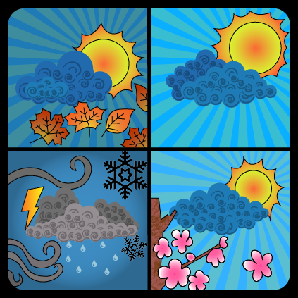

# Cloud-Four



Aplicación diseñada para conectarse a la API de weatherapi.com y mostrar información sobre el clima actual de la ciudad seleccionada, también cuenta con una opción de búsqueda por si la ciudad deseada no se muestra en la pantalla principal.

# Imágenes del proyecto
<p align="center"></p><br>
<p align="center"></p><br>
<p align="center"></p><br>

# Tecnologías utilizadas

- React native
- Expo 
- React navigation
- NativeBase
- Axios
- expo-font

# Aplicaciones utilizadas

- Android Studio
- Adobe Photoshop
- Adobe Illustrator
- Adobe Color

# Recursos 

- Paleta de colores

<p align="center"></p><br>
<p align="center"></p><br>

- Tipografía
    * Goldman-Regular
    * Goldman-Bold
    
# Instrucciones para la instalación 
Para clonar este repositorio necesitas tener instalado <code>node</code>, <code>npm</code> y <code>expo-cli</code> de manera global en tu computadora.

WeatherAPI key: <br>
Para que la aplicación pueda funcionar, 
se necesita una API key válida para que te puedas comunicar con la base de datos de WeatherAPI. Cloud-Four implementa la versión 1 de dicha API.

Debes crear una cuenta utilizando el siguiente enlace: <code><a href="https://www.weatherapi.com/signup.aspx ">WeatherAPI</a></code>.

Una vez que tengas tu API key, debes crear el archivo <code>enviroment.js</code> en la raíz del directorio y configurarlo de la siguiente manera:
<br>
<br>

```js
import Constants from "expo-constants";

const ENV = {
    dev: {
        apiUrl: "https://api.weatherapi.com/v1/",
        apiKey: "Tu API key obtenida desde weatherapi.com"
    }
};

const getEnvVars = (env = Constants.manifest.releaseChannel) =>{
    if(__DEV__){
        return ENV.dev;
    }
};

export default getEnvVars;

```

<br>

# Instalación: 
- Primero debe instalar Node.js <br>
Utilice el siguiente enlace: <br>
<code><a href="https://nodejs.org/en/download/">Node.js</a></code>

- Instalar los recursos de Expo <br>
<code>npm install</code> <br>
<code>npm install -g expo-cli exp</code>

- Iniciar Expo Metro: <br>
<code>expo start</code>

# Fuentes:
- Descarga de fuentes <br>
https://fonts.google.com/?preview.text_type=custom&preview.text=windows%20

- Como utilizar rutas de imágenes en el proyecto <br>
https://riptutorial.com/es/react-native/example/31757/usando-variable-para-ruta-de-imagen

- Configurar correctamente las fuentes <br>
https://docs.expo.io/guides/using-custom-fonts/